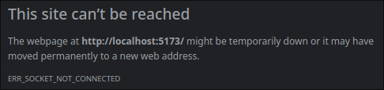

## Описание

Напиши Todo List в соответствии с [макетом](https://www.figma.com/file/vBoI7L0RN55cH4pB9TTShS/%D0%9C%D0%B0%D0%BA%D0%B5%D1%82-%D1%81%D1%82%D1%80%D0%B0%D0%BD%D0%B8%D1%86%D1%8B-%D0%B4%D0%BB%D1%8F-%D0%B7%D0%B0%D0%B4%D0%B0%D0%BD%D0%B8%D1%8F-3?node-id=0%3A1)  (макет приблизительный, ты волен придумать свое дизайнерское решение).

Для выполнения задания, вам потребуется обращаться к серверу посредством API. Ознакомьтесь с [документацией](https://todo.doczilla.pro/swagger-ui/index.html?configUrl=/v3/api-docs/swagger-config).

Что должно быть реализовано:

1. Поиск задач по названию.
2. Календарь с возможностью выбора даты.
3. Кнопка для вывода задач на сегодняшнюю (текущую) дату.
4. Кнопка для вывода задач на текущую неделю.
5. Возможность сортировать список задач по дате.
6. Возможность вывода только невыполненных задач.
7. Возможность открывать полное описание задачи (например, в модальном окне).
8. В календаре можно выбрать диапазон дат.
9. Поиск с выпадающим списком найденных задач, по нажатии на элементы которого открывается полное описание задачи.
## Использование

Запуск производится через командную строку с помощью Docker

Команда для запуска: `docker compose up -d`

После запуска перейти по адресу http://localhost:5173/

### Проблемы

При переходе по адресу http://localhost:5173/ после запуска контейнера появляется следующая ошибка:

Решения я не нашел и может быть проблема связана с моим браузером.
Поэтому предоставляю альтернативный запуск, как обход данной проблемы на первое время.

Для этого необходимо ввести следующую команду:
`docker compose up -d && cd frontend && npm run dev`

После выполнения данной команды, если файл docker-compose не был изменен, а именно не был убран сервис backend,
клиентская часть будет доступна по адресу http://localhost:5174/, иначе же по адресу http://localhost:5173/

### Примечания

- Не смог подключить JQuery UI, так как он выдавал ошибку, связанную с JQuery
- Так и не разобрался, как получить заметки по эндпоинту api/todos/date. Если вбивать с 0, до времени, прошедшего с 1 января 1970 г, то выдает в ответе пустой массив
- Причина, по которой api не вынесена в отдельный модуль - не понимание работы функций в JS. Вроде передаешь функцию, а в логах видишь `<x> is not a function `